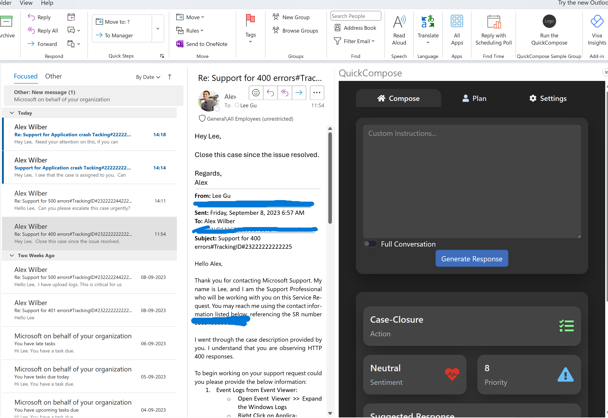
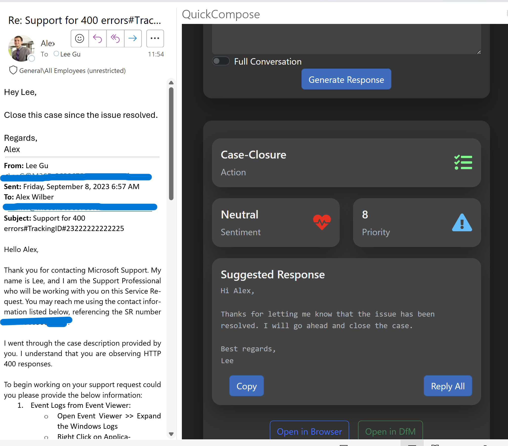
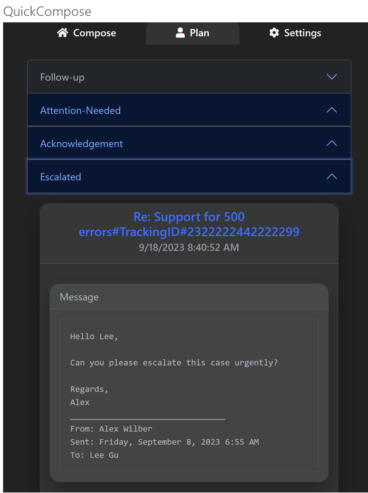
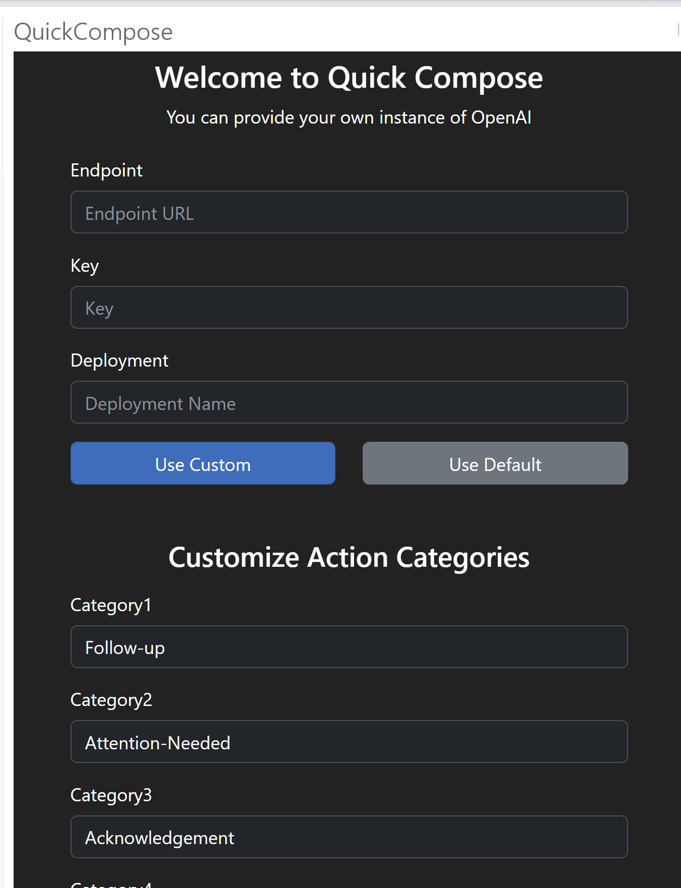

# Quick Compose - Your Outlook Planner
This was created in early days of LLM where there was limited support or no support on M365 Co-pilot and other tools that offer similar functionilty now. 

## Background
- For people working on emails, there can be 100's emails needing your attention. Every day, I start looking at my emails for planning my day.
- Once the day is planned out, there is need for generating responses for each of them based on priority.
- What if there is a way, once you open outlook, you are presented with all the items needing your attention prioritized. Better if the responses are pre-generated for review!

## Solution
-With the solution as an Outlook add-in, it opens up in the side-bar within the context of an email. It can pre-generate responses or with custom prompts. 
- Also, on the other tab, it has already gone through emails and analyzed them for sentiment, priority and action needed. It also has generates a response which you can review and send. 
- Fully customizable with categories and LLM endpoint.
- This could also be extended to work with other work managements tools like DFM, Git etc.

## Screenshots

 
 
 

## Projects
- [AnonymizerAPI](AnonymizerAPI) - Anonymizer API - Presidio based API to anonymize PII data. It is used to anonymize the email content before sending it to LLM endpoint.
- [outloo-blazor-addin](outlook-blazor-addin) - Web project that will hosted in Outlook add-in. It is a Blazor project that uses the Outlook JS API to get the context of the email and send it to LLM endpoint
- [outlook-blazor-sideloader](outlook-blazor-sideloader) - Outlook WebAddIn Project
- [Desktop Client](OutlookMAUI8) - Offers similar functionality as the web add-in. It is desktop project uses COM Add-in to get the context of the email and send it to LLM endpoint. Works only with Outlook Classic Desktop client.

## References
* [Blazor Add In Sample](https://github.com/OfficeDev/Office-Add-in-samples/tree/main/Samples/blazor-add-in/outlook-blazor-add-in)
* [Office.context.mailbox](https://learn.microsoft.com/en-us/javascript/api/requirement-sets/outlook/requirement-set-1.5/office.context.mailbox?view=powerpoint-js-preview)
* [Office.context.mailbox.item](https://learn.microsoft.com/en-us/javascript/api/requirement-sets/outlook/requirement-set-1.5/office.context.mailbox.item?view=powerpoint-js-preview)