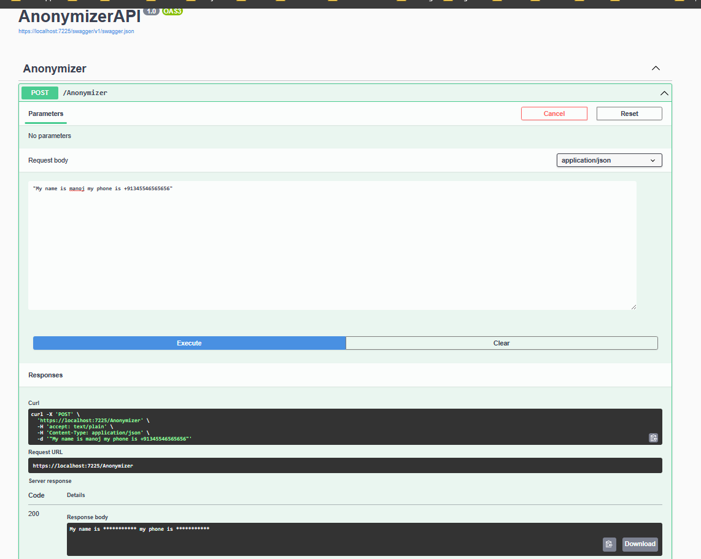

# Installation steps for Presidio Anonymizer API

# 1. Install docker
[Docker Desktop WSL 2 backend on Windows | Docker Documentation](https://docs.docker.com/desktop/windows/wsl/#download)

# 2. Install Presedio docker images
[Installation - Microsoft Presidio](https://microsoft.github.io/presidio/installation/)

# 3. Clone project
 - Test the Anonymizer API project using Swagger
	 - 
 - Publish Anonymizer API to local IIS
 - 
